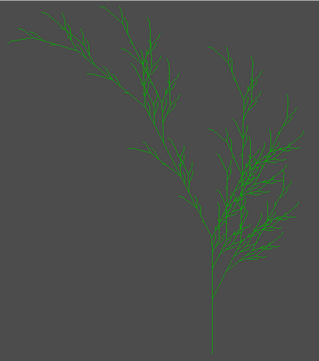

# Description
“Fish Tank game with Eel” is a snake game-esque with the twist of it being in 3D. The game takes place in a fish tank decorated with plants generated by L-system grammars and terrain generated from OpenSimplex noise. The tank is viewed by the player from an angled camera making use of an orthogonal projection. You take control of an eel swimming through a fish tank, looking down on it with an isometric view, full of its favorite snack, red fish. Each fish is controlled by an AI reacting to simple stimulus to make movement decisions. Your goal is to have the eel eat all five fish. As the eel continues to eat fish, it gains the nutrition it needs to grow larger.

## Godot Engine

For this project, we used the Godot game engine (v 3.5). The engine is coded in C++ and can be scripted in with the custom GDscript language. This project uses GDscript for all its scripting. Also, the engine is distributed under the MIT license. Our team decided to go with this engine because of the simplicity it’s node based system and GDscript, the incredibly extensive and beginner friendly documentation, the uniqueness of the engine, and its free and open source philosophy.

# Design and Implementation
## Eel and Movement Controls

## Scene Setup

This is general overview of what the game looks like. The scene consists of several basic elements:
  - The frame of the fishtank
  - The glass on the fishtank
  - The terrain at the base of the fishtank
  - the fish swimming inside the fishtank
  - The plants growing out of the terrain
  - The table the fishtank sits on
  - The walls that form the background around the fishtank and table
  - The Eel
The Godot game engine uses a node based scene hierarchy. There are several different types of nodes. Different nodes may have different behaviors. To create the visual arrangement of this scene and the interactions between the different objects, we make use of Godot's scene heiarchy.
## Terrain Generation
## Fish

## Plant Generation

# Lessons Learnt

# Possible Future Improvements
